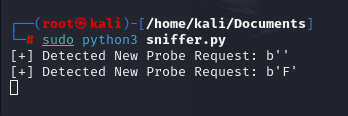

# Wifi-Sniffer
Python Wifi Sniffing Cyber Security project

This is a easy starter project to help understand Kali Linux, Virtual Machines and Python better. The aim of the project is to identify devices on reachable wifi networks. 

# Virtual Machine setup
- Go to https://www.virtualbox.org/ and download the software
- Configure it to your liking

# Kali Linux
- I choose to download a pre built Kali VM for Virtual Box: https://www.kali.org/get-kali/#kali-virtual-machines
- This documentation helps with the setup: https://www.kali.org/docs/virtualization/import-premade-virtualbox/

# Issues
- I ran into the issue of wlan0 not being enabled on my machine, this Youtube video helped me fix it:https://www.youtube.com/watch?v=3wWR6qTcufU

# Instructions
1. Set up Kali VM
2. Copy sniffer.py into the kali machines documents
3. Open a root terminal
4. 'ifconfig' - view all networks on your machine, ensure wlan0 is available
5. 'ifconfig wlan0 down' - take this wireless network down for the machine, use 'ifconfig' to ensure it is down (it will not be visable)
6. 'iwconfig wlan0 mode monitor' - when we put the network back up it will be in monitor mode
7. 'iwconfig wlan0 up' - put the network back up, it will be visable again
8. Navigate and cd into sniffer.py directory
9. 'python sniffer.py' - Run the script
10. Devices identified will be displayed over the course of running

# Sniffer.py line by line
from scapy.all import * - Scapy Library is used for python network packet manipulation
from scapy.layers.dot11 import Dot11ProbeReq - Specifically imports the Dot11ProbeReq class from the dot11 layer in Scapy, which is used for handling 802.11 (Wi-Fi) probe request frames

interface = 'wlan0' - This specifies the network interface to be used for sniffing packets. In this case, it's set to 'wlan0', which is typically the name for a wireless network interface on Linux systems
probeReqs = [] - We then initialize an empty list called probeReqs to store the SSIDs (network names) of detected probe requests

def sniffProbes(p) - This defines a function named sniffProbes that takes a single argument p, which represents a packet.
if p.haslayer(Dot11ProbeReq) - This checks if the packet p contains a Dot11ProbeReq layer, indicating it is a Wi-Fi probe request.
netName = p.getlayer(Dot11ProbeReq).info - This extracts the SSID (network name) from the Dot11ProbeReq layer of the packet.
if netName not in probeReqs - This checks if the extracted SSID is not already in the probeReqs list.
probeReqs.append(netName) - If the SSID is not in the list, it appends the SSID to the probeReqs list.
print(f'[+] Detected New Probe Request: {netName}') - This prints a message indicating a new probe request has been detected, along with the SSID.

sniff(iface=interface, prn=sniffProbes) - We start sniffing packets on the specified network interface (wlan0). The prn=sniffProbes parameter specifies that the sniffProbes function should be called for each packet that is captured.

# Disclosures

This project was only about deepening my interest in security fundamentals
NO ILL WILL was or is intended by this project
To test if it works, turn wifi on and off on one of your devices. I did not leave the code running to view anyone elses activity. 
